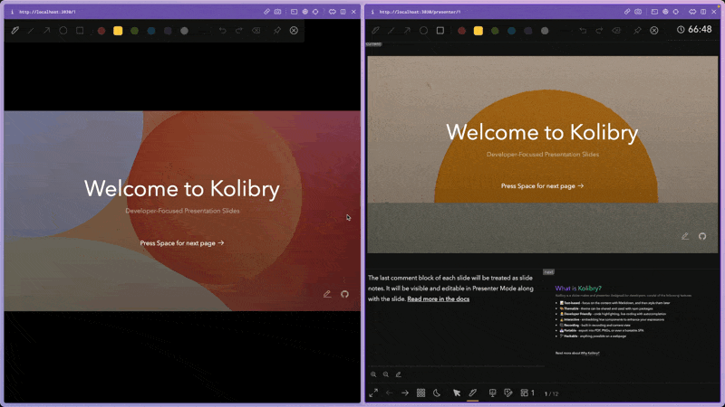

# Drawing & Annotations

We have [drauuIt](https://github.com/nyxb/drauu-it) built-in for drawing and annotation that could enhance your presentation further.

To start, click the <carbon-pen class="inline-icon-btn"/> icon in the toolbar and start drawing. It's also available in the [Presenter Mode](/guide/presenter-mode). Drawings and annotations you created will be **synced up** automatically across all instances in real-time.



## Use with Stylus Pen

When using a stylus pen on a tablet (for example, iPad with Apple Pencil), Kolibry could smartly detect the input type. You can directly draw on your slides with the pen without turning on the drawing mode, while having your fingers or mouse control the navigation.

## Persist Drawings

The following frontmatter configuration allows you to persist your drawings as SVGs under `.kolibry/drawings` directory and have them inside your exported pdf or hosted site.

```md
---
drawings: 
  persist: true
---
```

## Disable Drawings

Entirely:

```md
---
drawings: 
  enabled: false
---
```

Only in Development:

```md
---
drawings: 
  enabled: dev
---
```

Only in Presenter Mode:

```md
---
drawings: 
  presenterOnly: true
---
```

## Drawing Syncing

By default, Kolibry syncs up your drawings across all instances. If you are sharing your slides with others, you might want to disable the syncing by:

```md
---
drawings: 
  syncAll: false
---
```

With this config, only the drawing from the presenter instance will be able to sync with others.


